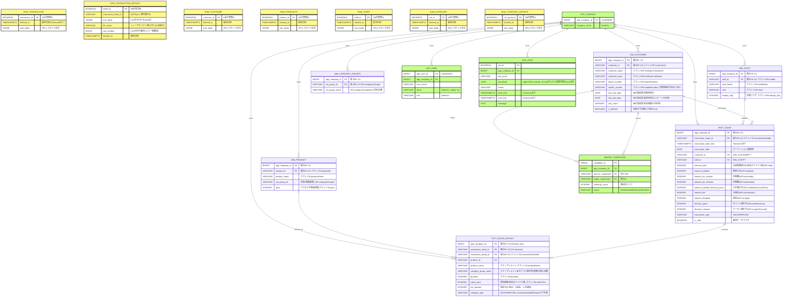

```mermaid
erDiagram
    %% ==========================================
    %% Schema: RAW (Staging Area)
    %% API/CSVデータを保存。取得単位管理のためIDはBIGSERIAL
    %% ==========================================
    RAW_TRANSACTION:::RAW {
        BIGSERIAL transaction_id PK "DB内管理ID"
        TIMESTAMPTZ fetched_at "取得日時(Timezoneあり)"
        JSONB json_body "APIレスポンス全文"
    }

    RAW_TRANSACTION_DETAILS:::RAW {
        BIGSERIAL detail_id PK "DB内管理ID"
        VARCHAR transaction_head_id "NOTNULL 親の取引ID"
        JSONB json_body "CSVの1行分をJSON化"
        VARCHAR file_name "トレーサビリティ用(どのCSV由来か)"
        BIGINT row_number "CSV内の行番号(エラー調査用)"
        TIMESTAMPTZ fetched_at "取得日時"
    }

    RAW_CUSTOMER:::RAW {
        BIGSERIAL customer_id PK "DB内管理ID"
        TIMESTAMPTZ fetched_at "取得日時"
        JSONB json_body "APIレスポンス全文"
    }

    RAW_PRODUCTS:::RAW {
        BIGSERIAL product_id PK "DB内管理ID"
        TIMESTAMPTZ fetched_at "取得日時"
        JSONB json_body "APIレスポンス全文"
    }

    RAW_STAFF:::RAW {
        BIGSERIAL staff_id PK "DB内管理ID"
        TIMESTAMPTZ fetched_at "取得日時"
        JSONB json_body "APIレスポンス全文"
    }

    RAW_CATEGORY:::RAW {
        BIGSERIAL cat_id PK "DB内管理ID"
        TIMESTAMPTZ fetched_at "取得日時"
        JSONB json_body "APIレスポンス全文"
    }

    RAW_CATEGORY_GROUPS:::RAW {
        BIGSERIAL cat_group_id PK "DB内管理ID"
        TIMESTAMPTZ fetched_at "取得日時"
        JSONB json_body "APIレスポンス全文"
    }

    %% ==========================================
    %% Schema: DWH (Analytics Core)
    %% マルチテナント対応：複合主キー(CompanyID + スマレジID)
    %% ==========================================

    DIM_CUSTOMER {
        BIGINT app_company_id PK "複合PK 1/2"
        VARCHAR customer_id PK "複合PK 2/2,スマレジAPI:customerId"
        VARCHAR customer_name "スマレジAPI:firstName+lastName"
        VARCHAR customer_kana "スマレジAPI:firstKana+lastKane"
        VARCHAR phone_number "スマレジAPI:phoneNumber"
        VARCHAR mobile_number "スマレジAPI:mobileNumber,今携帯番号のみの人多い"
        DATE first_visit_date "★計算結果:初回利用日"
        DATE last_visit_date "★計算結果:最終利用日(リピート分析用)"
        INTEGER visit_count "★計算結果:来店回数(F分析用)"
        BOOLEAN is_deleted "名寄せで消滅した場合True"
    }

    DIM_STAFF {
        BIGINT app_company_id PK "複合PK 1/2"
        VARCHAR staff_id PK "複合PK 2/2 スマレジAPI:staffId"
        VARCHAR staff_Name "スマレジAPI:staffName"
        VARCHAR rank "スマレジAPI:rank"
        INTEGER employ_flag "在籍フラグ スマレジAPI:display_flag"
    }

    DIM_PRODUCT {
        BIGINT app_company_id PK "複合PK 1/2"
        VARCHAR product_id PK "複合PK 2/2 スマレジID:productId"
        VARCHAR product_name "スマレジID:productName"
        VARCHAR cat_group_id "技術/店販(最新) API:categoryGroupId"
        INTEGER price "マスタ上の商品単価,スマレジID:price"
    }
    
    DIM_CATEGORY_GROUPS{
        BIGINT app_company_id PK "複合PK 1/2"
        VARCHAR cat_group_id PK "複合PK 2/2 API:categoryGroupId"
        VARCHAR cat_group_name "API:categoryGroupName 技術/店販"
    }

    FACT_SALES {
        BIGINT app_company_id PK "複合PK 1/2"
        VARCHAR transaction_head_id PK "複合PK 2/2 スマレジID:transactionHeadId"
        
        TIMESTAMPTZ transaction_date_time "Timezoneあり"
        DATE transaction_date "パーティション/検索用"
        
        VARCHAR customer_id FK "DIM_CUSTOMERへ"
        VARCHAR staff_id FK "DIM_STAFFへ"

        %% --- 金額・税（1円の壁対策） ---
        INTEGER amount_total "決済総額(税込),返金はマイナス値(API:total)"
        INTEGER amount_subtotal "税抜小計(API:subtotal)"
        INTEGER amount_tax_include "内税額(API:taxInclude)"
        INTEGER amount_tax_exclude "外税額(API:taxExclude)"

        INTEGER amount_subtotal_discount_price "小計値引き(API:subtotalDiscountPrice)"
        INTEGER amount_fee "手数料(API:commission)"
        INTEGER amount_shipping "送料(API:carriage)"
        INTEGER discount_point "ポイント値引き(API:pointDiscount)"
        INTEGER discount_coupon "クーポン値引き(API:couponDiscount)"

        VARCHAR transaction_type "SALES/REFUND"
        BOOLEAN is_void "取消データフラグ"
    }

    FACT_SALES_DETAILS {
        BIGINT app_company_id PK "複合PK 1/3 (Partition Key)"
        VARCHAR transaction_head_id PK "複合PK 2/3 (Co-location)"
        VARCHAR transaction_detail_id PK "複合PK 3/3 スマレジID:transactionDetailId"
        
        VARCHAR product_id FK
        VARCHAR product_name "スナップショット,スマレジID:productName"
        VARCHAR category_group_name "スナップショット★カテゴリ保存用(重要),技術/店販"
        
        INTEGER quantity "スマレジID:quantity"
        INTEGER sales_price "実売価格,返金はマイナス値,スマレジID:salesPrice"
        INTEGER tax_division "税区分(0:税込、1:税抜、2:非課税)"
        VARCHAR category_type "SALES/REFUND_transactionDetailDivisionより判断"
    }

    %% ==========================================
    %% Schema: SYS (System Management)
    %% ==========================================
    APP_COMPANY:::SYS{
        BIGINT app_company_id PK "snowflakeID"
        VARCHAR company_name "NotNULL"
    }
    
    APP_USER:::SYS{
        BIGINT app_user_id PK "snowflakeID"
        BIGINT app_company_id FK
        VARCHAR user_name
        VARCHAR email "NotNULL unique inx"
        VARCHAR role "NotNULL"
    }

    JOB_LOGS:::SYS {
        BIGSERIAL job_id PK
        BIGINT app_company_id FK
        VARCHAR job_name
        JSON job_detail "{table:RAW_Details, id:119}のように処理内容をjson記述"
        VARCHAR status
        TIMESTAMPTZ start_time "Timezoneあり"
        TIMESTAMPTZ end_time "Timezoneあり"
        TEXT message
    }

    MERGE_CANDIDATES:::SYS {
        SERIAL candidate_id PK
        BIGINT app_company_id FK
        VARCHAR source_customerId FK "消えるID"
        VARCHAR target_customerId FK "残るID"
        INTEGER similarity_score "類似性スコア"
        VARCHAR status "PENDING/MERGED/IGNORED"
        %% Constraint: UNIQUE(app_company_id, source, target)
    }


    %% ==========================================
    %% Relationships
    %% ==========================================
    
    %% Fact - Dimensions
    DIM_CUSTOMER ||--o{ FACT_SALES : "purchases"
    DIM_STAFF ||--o{ FACT_SALES : "handles"
    
    %% Fact Header - Detail (複合キーによる強固な親子関係)
    FACT_SALES ||--|{ FACT_SALES_DETAILS : "contains"
    
    %% Detail - Item
    DIM_PRODUCT ||--o{ FACT_SALES_DETAILS : "defined_as"

    %% System - DWH Logic
    DIM_CUSTOMER ||--o{ MERGE_CANDIDATES : "source"
    DIM_CUSTOMER ||--o{ MERGE_CANDIDATES : "target"

    %% MultiAccount compatible
    APP_COMPANY ||--o{ DIM_CUSTOMER : "owns"
    APP_COMPANY ||--o{ DIM_STAFF : "owns"
    APP_COMPANY ||--o{ DIM_PRODUCT : "owns"
    APP_COMPANY ||--o{ DIM_CATEGORY_GROUPS : "owns"
    APP_COMPANY ||--o{ FACT_SALES : "owns"
    APP_COMPANY ||--o{ FACT_SALES_DETAILS : "owns"
    APP_COMPANY ||--o{ APP_USER : "owns"
    APP_COMPANY ||--o{ JOB_LOGS : "owns"

    classDef RAW fill:#FFF78A,stroke:#333
    classDef SYS fill:#C4FF8A,stroke:#333
```