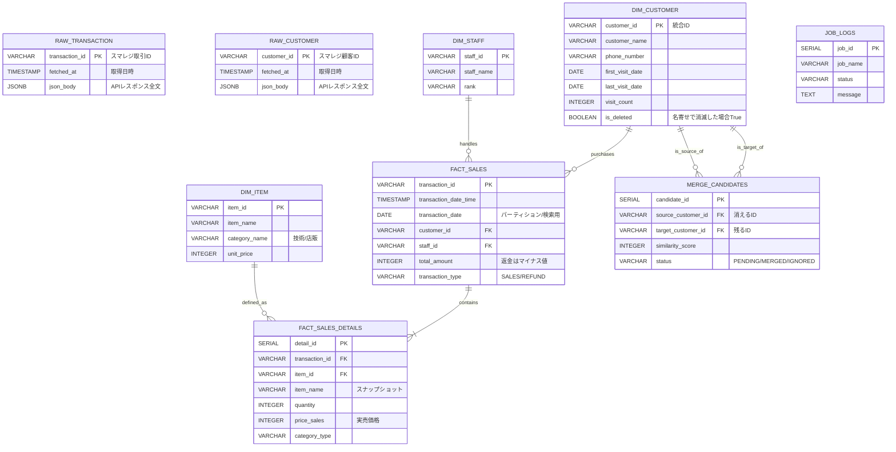

```mermaid
erDiagram
    %% ==========================================
    %% Schema: RAW (Staging Area)
    %% APIレスポンスをそのまま保存。DWHへの依存なし
    %% ==========================================
    RAW_TRANSACTION {
        VARCHAR transaction_id PK "スマレジ取引ID"
        TIMESTAMP fetched_at "取得日時"
        JSONB json_body "APIレスポンス全文"
    }

    RAW_CUSTOMER {
        VARCHAR customer_id PK "スマレジ顧客ID"
        TIMESTAMP fetched_at "取得日時"
        JSONB json_body "APIレスポンス全文"
    }

    %% ==========================================
    %% Schema: DWH (Analytics Core)
    %% スタースキーマ構成
    %% ==========================================
    DIM_CUSTOMER {
        VARCHAR customer_id PK "統合ID"
        VARCHAR customer_name
        VARCHAR phone_number
        DATE first_visit_date
        DATE last_visit_date
        INTEGER visit_count
        BOOLEAN is_deleted "名寄せで消滅した場合True"
    }

    DIM_STAFF {
        VARCHAR staff_id PK
        VARCHAR staff_name
        VARCHAR rank
    }

    DIM_ITEM {
        VARCHAR item_id PK
        VARCHAR item_name
        VARCHAR category_name "技術/店販"
        INTEGER unit_price
    }

    FACT_SALES {
        VARCHAR transaction_id PK
        TIMESTAMP transaction_date_time
        DATE transaction_date "パーティション/検索用"
        VARCHAR customer_id FK
        VARCHAR staff_id FK
        INTEGER total_amount "返金はマイナス値"
        VARCHAR transaction_type "SALES/REFUND"
    }

    FACT_SALES_DETAILS {
        SERIAL detail_id PK
        VARCHAR transaction_id FK
        VARCHAR item_id FK
        VARCHAR item_name "スナップショット"
        INTEGER quantity
        INTEGER price_sales "実売価格"
        VARCHAR category_type
    }

    %% ==========================================
    %% Schema: SYS (System Management)
    %% ==========================================
    JOB_LOGS {
        SERIAL job_id PK
        VARCHAR job_name
        VARCHAR status
        TEXT message
    }

    MERGE_CANDIDATES {
        SERIAL candidate_id PK
        VARCHAR source_customer_id FK "消えるID"
        VARCHAR target_customer_id FK "残るID"
        INTEGER similarity_score
        VARCHAR status "PENDING/MERGED/IGNORED"
    }

    %% ==========================================
    %% Relationships
    %% ==========================================
    
    %% Fact - Dimensions
    DIM_CUSTOMER ||--o{ FACT_SALES : "purchases"
    DIM_STAFF ||--o{ FACT_SALES : "handles"
    
    %% Fact Header - Detail
    FACT_SALES ||--|{ FACT_SALES_DETAILS : "contains"
    
    %% Detail - Item
    DIM_ITEM ||--o{ FACT_SALES_DETAILS : "defined_as"

    %% System - DWH Logic
    DIM_CUSTOMER ||--o{ MERGE_CANDIDATES : "is_source_of"
    DIM_CUSTOMER ||--o{ MERGE_CANDIDATES : "is_target_of"
```