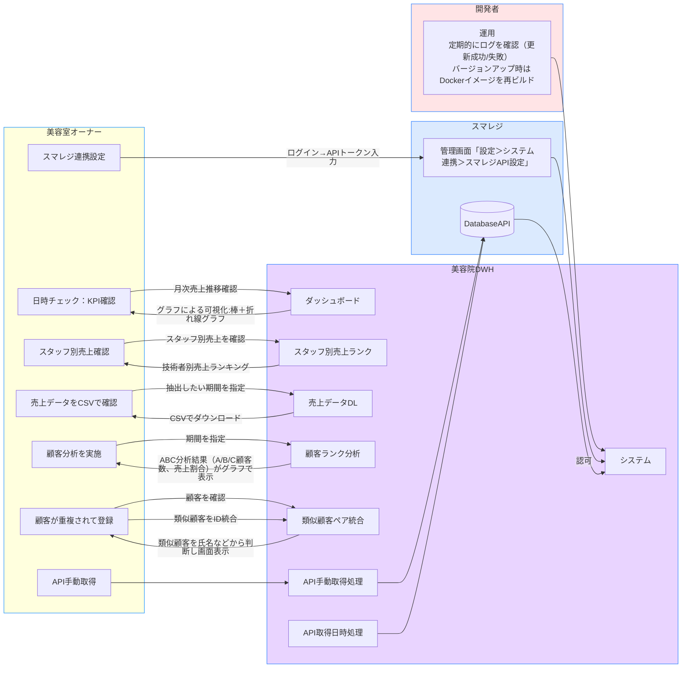
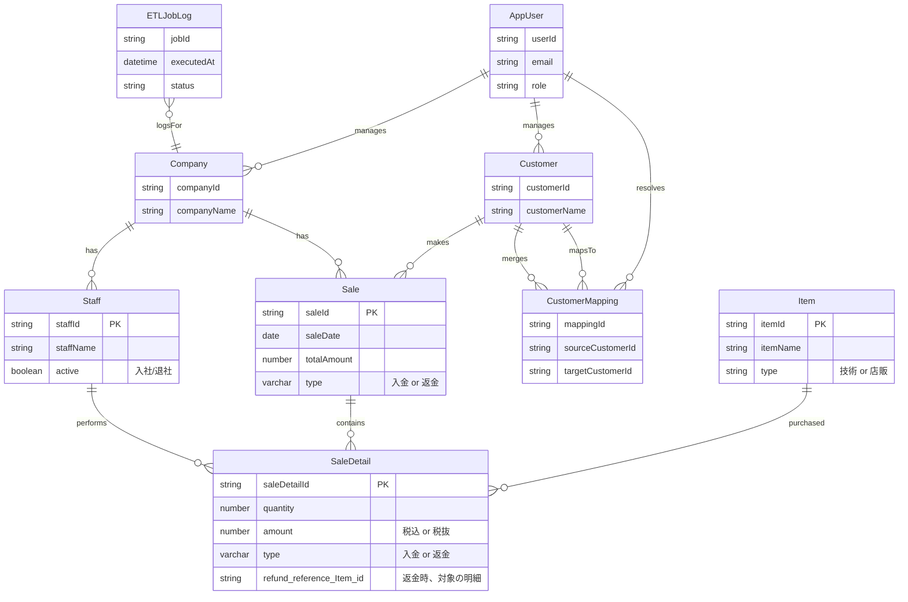

# ポートフォリオ「美容業向け売上分析DWH」
## 概要
### 1.プロジェクト名称：
美容業向け 売上分析ミニDWHシステム作成 

リポジトリ名 beauty-sales-dwh
### 2.目的
本プロジェクトは、美容サロンの売上データを取得し分析可能なDWH・ETL・Web分析基盤を個人開発で構築し、データ活用設計力・開発力・UI設計力を示すポートフォリオとして完成させることを目的とする。

### 3.背景と課題

中小規模の美容サロンでは、POSシステムにより売上データが記録されるが、そのデータを**経営判断に活かすための分析環境**が整っていないことが多い。

- データ抽出が手作業（CSV出力→Excel加工）
- 顧客マスタの重複により正確な集計が難しい
- 分析ノウハウが不足しており、傾向分析が属人的

これらを解消するため、**データ取得〜可視化までの一連フローを自動化**する軽量Webアプリを個人開発する。

### 4.機能概要
* タブレットPOSから抽出される売上データを同一のDBに投入できるDWH 
* 顧客は生データだと必ず重複が発生するので、売上分析の精度のため統一できるIDをユーザーが追加できる機能 
* 以下のUIを搭載
■ 月次売上推移グラフ（棒＋折れ線）■ 技術者別売上ランキング ■ 店販 vs 技術売上比率■ 顧客ランク（ABC分析結果） 
* DWHより売上データをCSVでDLできる（売上額の日月毎の推移は他のサービスでも見れるためDLのみ） 

### 5.対象ユーザー
- 美容室オーナー（兼 店舗管理者）
  - 現場シフト管理、数字管理をしている
  - ITは詳しくない
  - 月次数字とスタッフ評価判断を早くしたい

- システム管理者

### 想定データ規模（1店舗）  
・顧客数：〜5,000件  
・売上明細：年間〜40,000件  
→ PostgreSQL単体で十分処理可能（NoSQL, OLAPメンテ対象外）

### 6.利用者が得られる利益 
PC操作や統計の知識、分析のためには生データからデータを整備する時間など売上分析には時間や知識が必要だが、直接事業にコミットする事業者様の負担を軽減 

| ユーザー    | 得られるメリット                                        |
| ------- | ----------------------------------------------- |
| 美容室オーナー | 月次売上・スタッフ別売上・顧客ランクが自動で可視化され、最短3クリックで経営状況を確認できる  |
| システム管理者 | ETLジョブ・API連携状況をログで確認可能、メンテナンス性を担保               |
| 開発者（自分） | OAuth2＋DWH＋分析UIという**バックエンド〜フロント〜データ基盤までの実装力証明** |

## UIモック(Figma)
https://www.figma.com/design/1pJa6JpBpvmSSRZk33ACPm/beauty-sales-dwh?node-id=0-1&t=18BuChSP9cNVLubU-1

## 開発目標

| 項目 | 内容 |
|------|------|
| 対象業種 | 美容業（美容室・サロン） |
| 対応POS | スマレジ（API連携） |
| 開発体制 | 個人開発 |
| 開発期間 | 2026年2月末まで（3ヶ月） |
| 成果物 | Webアプリ（Docker構成）、要件定義書、ER図、README、デモ動画 |

## 技術スタック
**スマレジPOS** から売上データを自動取得し、 **Spring Boot を用いた ETL・DWH 構築と Next.js による可視化UI** を通じて  **データ統合から分析まで一貫した開発力を示すポートフォリオ**を目的とする。

| 分類 | 使用技術 | 目的 |
|------|-----------|------|
| フロントエンド | Next.js, TypeScript, Tailwind CSS | UI構築・グラフ表示 |
| バックエンド | Spring Boot (Java) | API連携・ETL処理 |
| データベース | PostgreSQL | DWH・正規化データ格納 |
| インフラ | Docker, Docker Compose | ローカル環境構築 |
| 可視化 | Chart.js / Recharts | 売上・顧客データ可視化 |
---

## 機能構成

### (1) データ収集層（ETL）
- OAuth2 + JWT（Resource Server）+ Spring Security 6による認証認可機能(OAuth2 Provider はGoogleのみ)
- スマレジAPIより売上・顧客・商品・スタッフデータを取得
- JSONデータを整形し、Staging→DWH層へ投入

### (2) データ統合層（DWH）
- PostgreSQL上でスキーマを正規化設計
- ユーザーが画面上でID統一編集可能

### (3) 分析・可視化層（Web UI）
- 月次売上推移グラフ（棒＋折れ線）
- 店販 vs 技術売上比率
- 技術者別売上ランキング
- 顧客ランク（ABC分析）
- CSVダウンロード機能（期間指定）

#### MVP機能範囲
| 機能カテゴリ | 含む                         | 含まない（将来）            |
| ------ | -------------------------- | ------------------- |
| データ取得  | ✔ スマレジAPI手動取得 / 日次自動更新     | ✘ 複数POS対応、Webhook連携 |
| DWH    | ✔ 正規化テーブル、売上・顧客・スタッフ・商品    | ✘ 商品カテゴリ・歩合テーブル     |
| データ品質  | ✔ 顧客名寄せ（半手動UI）             | ✘ AI類似検索、バルク統合、商品マスタの名寄せ      |
| 分析機能   | ✔ 月次売上・技術者別売上・店販 vs 技術売上比率 | ✘ 予約率・再来分析モデル       |
| 認証     | ✔ Google OAuth + JWT       | ✘ 権限階層、2FA、安全監査ログ   |
| 出力     | ✔ CSVエクスポート                | ✘ ExcelテンプレDL       |

## 利用者の行動シナリオ

## 概念データモデル
返金対応のエンティティも記載

