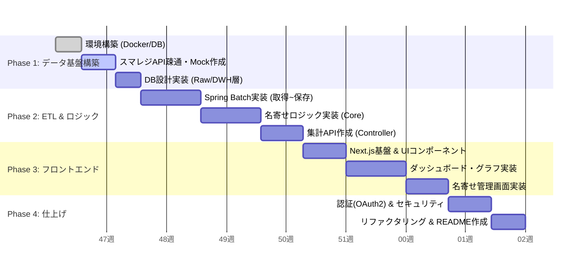

# 開発ロードマップ (Implementation Roadmap)

## 美容業向けDWH開発ロードマップ

## Phase 1: データ基盤とインフラ構築 (The Foundation)
**目標:** スマレジのデータがPostgreSQLに格納され、SQLで参照できる状態にする。
**期間目安:** 1〜2週間

- [ ] **1-1. Docker環境構築**
    - [ ] PostgreSQL, Spring Boot, pgAdmin(任意)を含む `docker-compose.yml` の作成と起動確認
- [ ] **1-2. DBスキーマ設計・実装**
    - [o] `raw_data` 層: APIレスポンスをそのまま保存するテーブル作成
    - [ ] `dwh` 層: 分析用に正規化したテーブル (`fact_sales`, `dim_customers` 等) 作成
- [ ] **1-3. スマレジAPI疎通・Mock作成**
    - [o] APIから実際のJSONを取得し、構造を確認
    - [ ] 開発用にJSONをローカルファイルとして保存（API制限回避のためのMockデータ作成）

## Phase 2: ETL処理とコアロジック実装 (The Core)
**目標:** データ取り込み〜名寄せ〜集計の一連フローをバックエンドで完結させる。
**期間目安:** 2〜3週間

- [ ] **2-1. Spring Batch 実装 (ETL)**
    - [ ] **Extract:** API (またはMock) からデータを読み込むReader実装
    - [ ] **Load:** RawテーブルへのWriter実装
    - [ ] **Transform:** Rawデータを加工してDWHテーブルへ移すProcessor実装
- [ ] **2-2. 名寄せロジック (Identity Resolution) 実装**
    - [ ] 氏名・電話番号等による「類似度判定サービス」の実装
    - [ ] 名寄せ候補テーブル (`merge_candidates`) へのデータ生成バッチ処理
- [ ] **2-3. 分析用API (REST Controller) 作成**
    - [ ] ダッシュボード用集計API (売上推移、スタッフランク、ABC分析)
    - [ ] 名寄せ候補リスト取得・統合実行用API

## Phase 3: Web UI実装 (The Face)
**目標:** バックエンドのデータを可視化し、ユーザーが操作可能な状態にする。
**期間目安:** 2〜3週間

- [ ] **3-1. フロントエンド基盤構築**
    - [ ] Next.js + TypeScript + Tailwind CSS の導入
    - [ ] 共通レイアウト (Sidebar, Header) のコンポーネント化
- [ ] **3-2. ダッシュボード・グラフ実装**
    - [ ] Recharts (または Chart.js) の導入
    - [ ] APIから取得したデータをグラフ・テーブルにバインド
- [ ] **3-3. 名寄せ管理画面 (UI) 実装**
    - [ ] 候補リストの表示 (左右比較UI)
    - [ ] 「統合する/しない」のアクションボタン実装とAPI連携

## Phase 4: セキュリティ・品質向上・仕上げ (The Polish)
**目標:** ポートフォリオとして公開・プレゼンできる品質に仕上げる。
**期間目安:** 1〜2週間

- [ ] **4-1. 認証・認可 (Security)**
    - [ ] Spring Security + OAuth2 (Google Login) 実装
    - [ ] JWTの発行とAPIリクエスト時の検証
- [ ] **4-2. エラーハンドリング & UX改善**
    - [ ] API接続エラー時やロード中のUI表示 (Skeleton Screen等)
    - [ ] バッチ処理失敗時のログ表示調整
- [ ] **4-3. ドキュメント作成 & デモ**
    - [ ] `README.md` の充実 (アーキテクチャ図、技術選定理由、ER図)
    - [ ] デモ動画の撮影とGIF化 (ファーストビューでのインパクト用)
